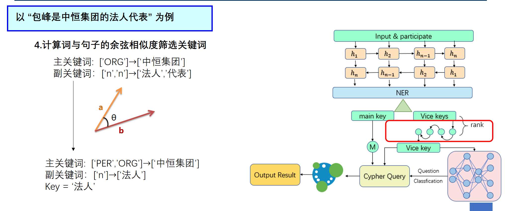

# 金融知识图谱

该项目的代码目前并不完整，而且Neo4j数据库也不包含在Github项目之中。大家可以借鉴我们的前后端交互部分，实际上在作者看来这是最重要的一部分，除非你打算直接提交我们的项目。由于该项目已经完成2年了，因此大量模型文件已经缺失，可能会在几个月之后才能修复完成。在此期间如果您看到了我们的项目，也不必费过多心思跑通代码。因为笔者这边不小心删掉了一些文件...

## 项目简介

本项目是基于瑞斯数据库做的金融知识图谱，涵盖知识图谱可视化，问答系统等功能

知识图谱部分是基于Neo4j，从瑞斯数据库上爬取了许多公司的信息，整理成为知识图谱。而问答系统则是利用了神经网络方法，实现了语义理解功能，能够根据输入的问题灵活的进行数据库查询。

## 数据收集

数据收集部分是基于瑞斯金融数据库，从中抽取三元组信息，然后存放到Neo4j GraphBased Database中。我们会通过python脚本与neo4j数据库进行交互来获取其中的数据

## 问答系统

问答系统是基于语义，不过由于作者当时的NLP技术并不是特别精炼因此整体设计得非常冗余。也不再适合当下与训练模型横飞的时代。但是整体处理流程依然值得借鉴。

